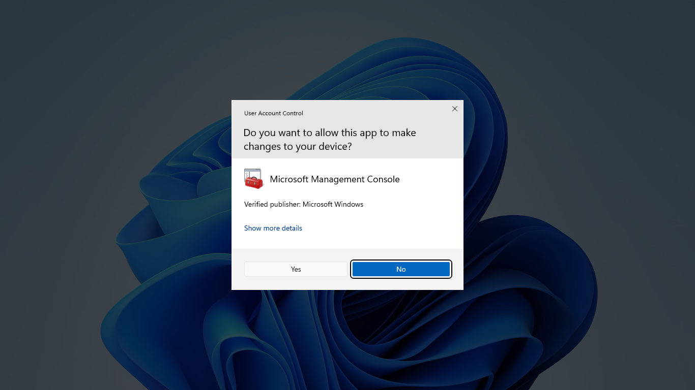
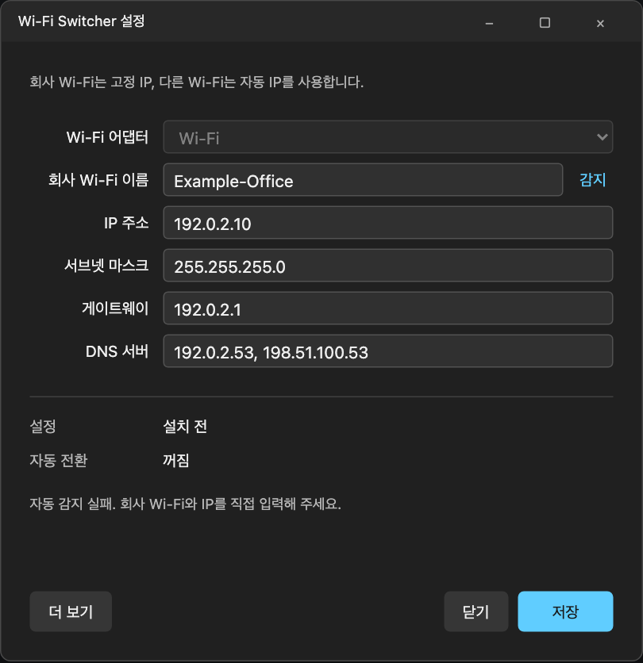

# EXEM Wi-Fi Switcher for Windows

회사 Wi-Fi에서는 **고정 IP**, 다른 Wi-Fi에서는 **자동 IP**로 바꿔 줍니다.

**Windows 11 x64 · 관리자 승인 필요 · 실기 검증 중인 시험판**

## 1. 다운로드하고 실행하세요

### [Windows 설치 파일 다운로드 (.exe)](https://github.com/Orchemi/exem-wifi-switcher-windows/releases/download/v0.2.0-alpha.2/WifiProfileSwitcher-Setup-0.2.0-alpha.2.exe)

내려받은 **Setup.exe를 더블클릭**하세요. 터미널이나 .NET 별도 설치는 필요 없습니다.

Windows가 실행을 막나요?

서명되지 않은 시험판이라 경고가 나올 수 있습니다. 이 저장소에서 받은 파일인지 확인하세요.
‘Windows의 PC 보호’가 뜨면 **추가 정보 → 실행**으로 진행합니다. 회사 정책으로 차단되거나 실행 버튼이 없으면 관리자에게 승인을 요청하세요.

[화면별 실행 안내](docs/INSTALL-GUIDE.html)를 내려받아 브라우저로 열면 자세한 이미지를 볼 수 있습니다.

## 2. 관리자 승인에서 ‘예’를 누르세요

IP 설정을 바꾸는 프로그램을 설치하려면 관리자 승인이 필요합니다.
**‘아니오’가 파란색이어도, 설치를 진행하려면 ‘예’를 선택하세요.**

Microsoft의 Windows 화면 예시입니다. 실제 앱 이름과 게시자 표시는 다릅니다. [출처](https://learn.microsoft.com/en-us/windows/security/application-security/application-control/user-account-control/)

## 3. 회사 Wi-Fi 설정을 저장하세요

자동으로 채워지면 값을 확인하고 **저장**을 누르세요.
감지하지 못하면 회사 Wi-Fi 이름과 본인에게 할당된 IP·DNS를 직접 입력하세요.

앱 구성에 맞춘 HTML 미리보기 캡처입니다. 주소는 문서용 예시이므로 그대로 입력하지 마세요.

## 4. ‘켜기’를 누르면 끝입니다

회사 Wi-Fi에 연결한 뒤 **자동 전환 → 켜기**를 누르세요. 이후에는 창을 닫아도 동작합니다.

HTML 미리보기 캡처입니다. Wi-Fi 이름을 계속 읽지 못하면 설정은 저장되지만 자동 전환은 켜지지 않습니다.

## 끄거나 제거하려면

Setup.exe를 다시 열어 **끄기** 또는 **더 보기 → 앱 제거**를 선택하세요.
제거해도 현재 IP는 유지됩니다. 자동 IP로 돌아가려면 제거 전에 **더 보기 → DHCP로 복구**를 사용하세요.

[이전 시험판에서 재설치하기 · 오류 해결](docs/MANUAL-SETUP.md) · [자세한 안내](docs/README.md)
