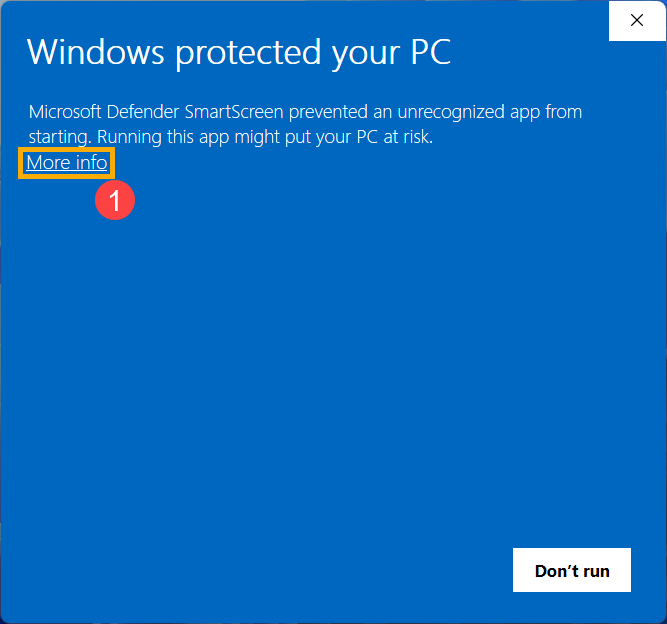
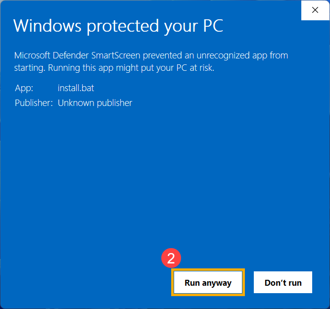

# EXEM Wi-Fi Switcher for Windows

회사 Wi-Fi에서는 **고정 IP**, 다른 Wi-Fi에서는 **자동 IP**로 바꿔 줍니다.

**x64 · 관리자 승인 필요**

## 1. 다운로드하고 실행하세요

### [Windows 설치 파일 다운로드 (.exe)](https://github.com/Orchemi/exem-wifi-switcher-windows/releases/download/v0.2.0-alpha.3/WifiProfileSwitcher-Setup-0.2.0-alpha.3.exe)

내려받은 **Setup.exe를 더블클릭**하세요. 터미널이나 .NET 별도 설치는 필요 없습니다.

### Windows가 실행을 막나요?

이 저장소에서 받은 파일인지 확인한 뒤, 아래 순서로 누르세요.

**① 추가 정보 (More info)**

**② 실행 (Run anyway)**

[Windows 경고 화면 예시](docs/screenshots/README.md)입니다. 실제 파일 이름은 다릅니다.
실행 버튼이 없거나 회사 정책으로 차단되면 관리자에게 승인을 요청하세요.

## 2. 관리자 승인에서 ‘예’를 누르세요

IP 설정을 바꾸는 프로그램을 설치하려면 관리자 승인이 필요합니다.
**‘아니오’가 파란색이어도, 설치를 진행하려면 ‘예’를 선택하세요.**

## 3. 설정을 확인하고 ‘저장하고 시작’을 누르세요

자동으로 채워지면 값을 확인하고 **저장하고 시작**을 누르세요.
감지하지 못하면 회사 Wi-Fi 이름과 본인에게 할당된 IP·DNS를 직접 입력하세요.

## 4. 자동 전환이 시작됩니다

회사 Wi-Fi 감지가 확인되면 자동으로 시작합니다. **켜짐**을 확인한 뒤 창을 닫으세요.

## 끄거나 제거하려면

Setup.exe를 다시 열어 **끄기** 또는 **더 보기 → 앱 제거**를 선택하세요.
제거해도 현재 IP는 유지됩니다. 자동 IP로 돌아가려면 제거 전에 **더 보기 → DHCP로 복구**를 사용하세요.

[이전 시험판에서 재설치하기 · 오류 해결](docs/MANUAL-SETUP.md) · [자세한 안내](docs/README.md)
